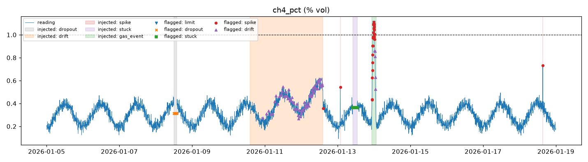

# mine-sensor-monitor

Finds **broken sensors** and **real hazards** in mine environmental data: methane, carbon monoxide, oxygen, dust (PM10) and discharge-water pH.

Environmental compliance depends on trusting the data. A frozen logger or a slowly drifting gas sensor can report "all clear" for days. This project simulates realistic sensor streams, **injects known faults with labels**, and measures how many of them each detector catches, how quickly, and how many false alarms it raises.



*Methane over 14 days. Shaded bands are injected problems; markers are detections. The gas build-up (green) is flagged by the spike detector 50 minutes before the reading crosses the 1.0% limit.*

## Results

**Across 10 random seeds** (14 simulated days each, 5 sensors, 260 injected problems):

| problem | what it looks like | caught |
|---|---|---|
| dropout | 2 hours of missing data | 50 / 50 |
| stuck | reading frozen for 3 hours | 50 / 50 |
| drift | calibration drift ramping to 6 SDs over 2 days | 50 / 50 (median delay 8.8 h, max 11 h) |
| gas event | real methane build-up past the 1.0% limit | 10 / 10 |
| spike | single-point glitch, 8–12 SDs | 94 / 100 |

Point precision ranges from 0.987 to 0.993 across seeds, so about 1% of flagged points fall outside any injected problem. On seed 7, every one of the 32 alert episodes traces back to a real injected problem.

## How it works

| detector | method | why this method |
|---|---|---|
| `limit` | fixed alarm limits (high methane, CO, PM10; low oxygen; pH outside 6.5–8.5) | the rule operators act on |
| `dropout` | missing values | simplest failure, often the most common |
| `stuck` | no change at all for 1 hour | real sensors always have some noise |
| `spike` | robust z-score (median/MAD) over the last 4 hours | median and MAD aren't dragged around by the spike itself |
| `drift` | two-sided **CUSUM**, reset after each alarm | adds up many small deviations; catches slow drift that no single reading shows |

The key step is **removing the daily cycle first**. Dust and gas follow shift work and haul-road traffic. So the tool fits a smooth daily curve (sine and cosine terms, least squares) on 3 clean warm-up days, and the spike and drift detectors work on the leftover residual.

This came from a real failure during development. My first version compared each reading with the recent past and learned the daily pattern as a separate average for each 5-minute slot. That gave **0.24 precision** (three out of four alerts false) and missed small pH spikes hidden in the daily swing. Fitting a smooth curve and resetting CUSUM after each alarm raised precision to 0.99.

Other details:

- Every detector uses only past data, so it could run on a live stream.
- Drift detection skips points already explained as dropout, stuck or spike, so one fault can't trigger another alarm.
- Flags are merged into alert episodes (`alerts.csv`), so a 3-hour stuck sensor is one alert, not 36.

## Run it

```bash
python -m venv .venv && source .venv/bin/activate     # Windows: .venv\Scripts\activate
pip install -e ".[dev]"
python -m minemon --days 14 --seed 7 --out output   # readings.csv, alerts.csv, summary.md, one PNG per sensor
pytest -q
```

## Limitations and next steps

- **Synthetic data.** The noise is Gaussian and the faults are idealised. Real sensors quantise readings (which can look "stuck"), have correlated noise and fail in messier ways. The next step is replaying a public air-quality dataset with hand-labelled faults.
- **Sensors are checked one at a time.** Cross-checking related sensors (for example, CO and methane from the same ventilation district) would separate a real gas event from a single faulty sensor. Isolation Forest or a small autoencoder on the joint residuals are natural candidates.
- **Drift needs about 9 hours.** That's fine for calibration drift but too slow for safety. Real hazards are covered by the `limit` and `spike` detectors, not `drift`.
- Thresholds (`h`, `k`, robust z of 6) were set by hand on seed 7 and checked on seeds 1–10. They were not tuned on held-out data.

## Background

My research is on blockchain-based environmental compliance monitoring for mining. A tamper-proof record is only useful if the readings going into it are trustworthy, and this project is the data-quality gate in front of such a ledger. All data here is simulated; no real mine or permit data is used.

## License

MIT
